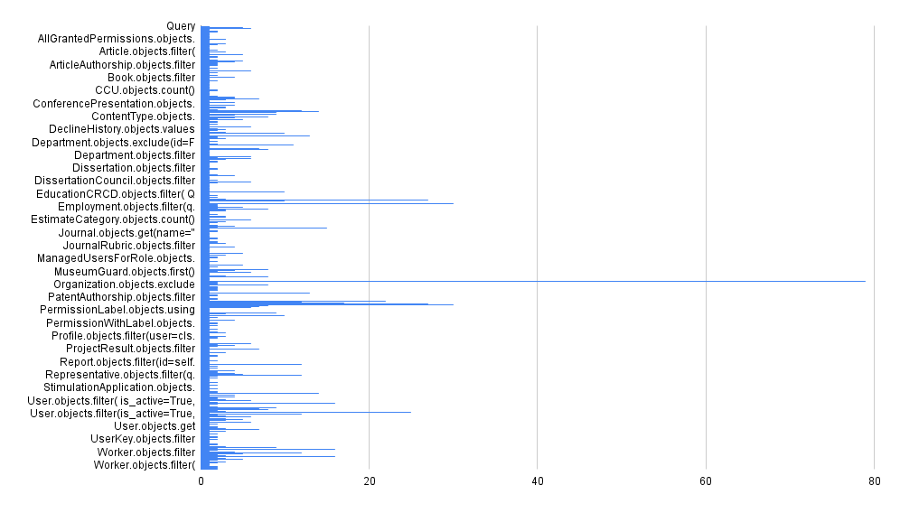
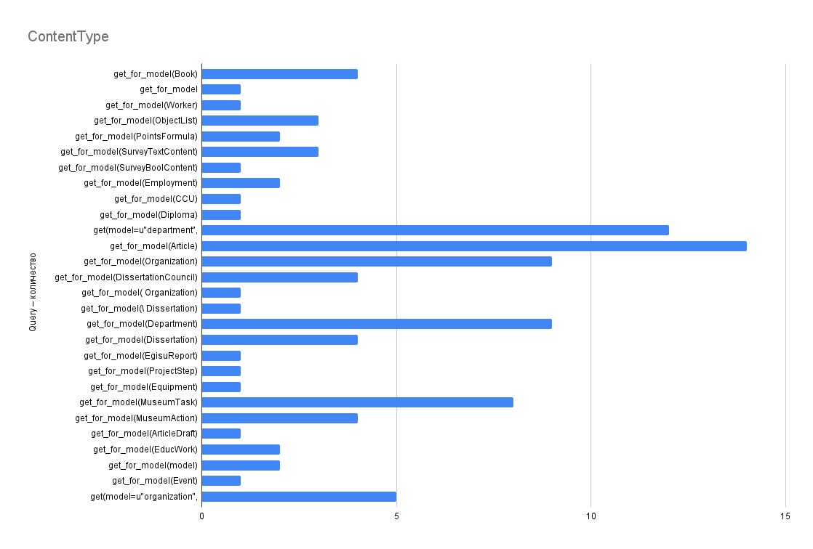
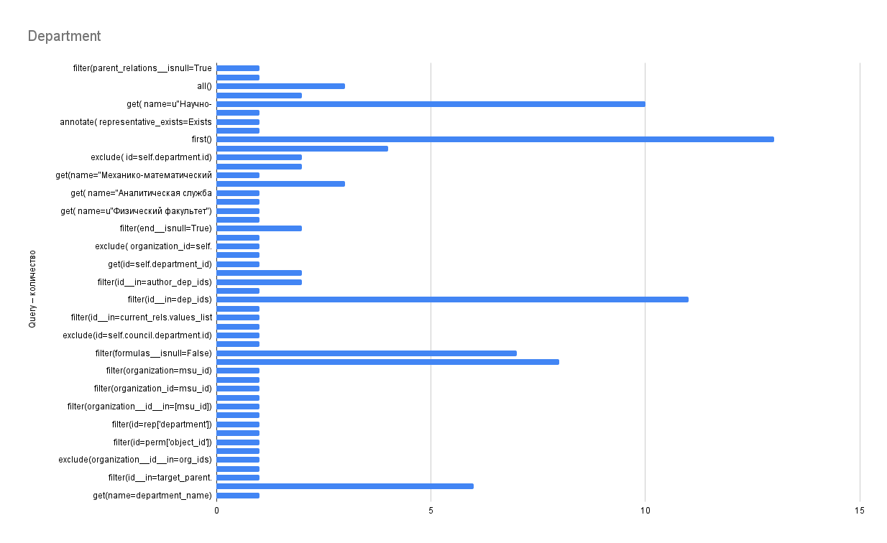

# Тестирование больших информационных систем на базе ИАС "ИСТИНА"

## Содержание

1. [Введение](#введение)
2. [Теоретические основы тестирования больших информационных систем](#теоретические-основы-тестирования-больших-информационных-систем)
   - [Общие принципы тестирования больших информационных систем](#общие-принципы-тестирования-больших-информационных-систем)
   - [Ключевые аспекты тестирования больших данных](#ключевые-аспекты-тестирования-больших-данных)
   - [Типы тестирования при работе с большими информационными системами](#типы-тестирования-при-работе-с-большими-информационными-системами)
3. [Особенности тестирования на эфемерных базах данных](#особенности-тестирования-на-эфемерных-базах-данных)
   - [Понятие эфемерной базы данных](#понятие-эфемерной-базы-данных)
   - [Преимущества использования эфемерных баз данных](#преимущества-использования-эфемерных-баз-данных)
   - [Методы работы с эфемерными базами данных](#методы-работы-с-эфемерными-базами-данных)
4. [Анализ наукометрической системы ИАС "ИСТИНА"](#анализ-наукометрической-системы-ИАС-ИСТИНА)
   - [Особенности архитектуры ИАС "ИСТИНА"](#особенности-архитектуры-иас-ИСТИНА)
   - [Специфика тестирования наукометрических систем](#специфика-тестирования-наукометрических-систем)
5. [Разработка методики тестирования ИАС "ИСТИНА" на эфемерной базе данных](#разработка-методики-тестирования-иас-ИСТИНА-на-эфемерной-базе-данных)
   - [Оценка числа обращений к базе данных](#оценка-числа-обращений-к-базе-данных)
   - [Логирование обращений к базе данных](#логирование-обращений-к-базе-данных)
   - [Тестирование на маленьком дампе](#тестирование-на-маленьком-дампе)
   - [Замер времени выполнения тестов](#замер-времени-выполнения-тестов)
6. [Практическая реализация тестирования](#практическая-реализация-тестирования)
   - [Создание моделей первой категории](#создание-моделей-первой-категории)
   - [Создание моделей второй категории](#создание-моделей-второй-категории)
   - [Автоматизация процесса тестирования](#автоматизация-процесса-тестирования)
7. [Анализ результатов и рекомендации](#анализ-результатов-и-рекомендации)
   - [Оценка эффективности разработанной методики](#оценка-эффективности-разработанной-методики)
   - [Рекомендации по оптимизации процесса тестирования](#рекомендации-по-оптимизации-процесса-тестирования)
8. [Заключение](#заключение)
9. [Список литературы](#список-литературы)

## Введение

Современные наукометрические системы играют ключевую роль в управлении научными данными, оценке публикационной активности и анализе цитируемости. Такие системы, как Scopus, Web of Science, Google Scholar и их аналоги, обрабатывают огромные объемы данных, что делает их тестирование сложной и ресурсоемкой задачей. Традиционные подходы к тестированию предполагают использование реальных баз данных (БД), что может приводить к ряду проблем, включая зависимость от внешних источников, длительное время выполнения тестов и сложности с воспроизводимостью результатов.

В связи с этим возникает необходимость в разработке методов тестирования, которые минимизируют зависимость от реальных данных, обеспечивая при этом достаточную надежность и покрытие функционала. Одним из перспективных подходов является использование **эфемерной базы данных** — временной, пустой или минимально заполненной БД, которая инициализируется на время выполнения тестов и уничтожается после их завершения. Такой подход позволяет:

1. **Устранить зависимость от реальных данных** – тесты становятся изолированными и не требуют доступа к внешним БД.
    
2. **Повысить скорость выполнения тестов** – отсутствие необходимости загружать и обрабатывать большие объемы информации ускоряет процесс тестирования.
    
3. **Обеспечить воспроизводимость** – каждый тест запускается в предсказуемом окружении, что исключает влияние сторонних факторов.
    
4. **Упростить CI/CD-интеграцию** – эфемерные БД легко развертываются в автоматизированных пайплайнах, что особенно важно для DevOps-практик.

Актуальность данной работы обусловлена растущими требованиями к надежности и масштабируемости наукометрических систем, а также необходимостью оптимизации процессов их тестирования. Внедрение эфемерных БД в тестовую инфраструктуру позволяет сократить издержки на поддержку тестовых сред и повысить эффективность разработки.

**Целью** курсовой работы является исследование возможностей тестирования наукометрических систем на эфемерной базе данных на примере ИАС "ИСТИНА", анализ преимуществ и ограничений данного подхода, а также разработка практических рекомендаций по его применению.

## Теоретические основы тестирования больших информационных систем

### Общие принципы тестирования больших информационных систем

Тестирование больших информационных систем представляет собой комплексный процесс, требующий особых подходов. В отличие от функционального тестирования, которое сосредоточено на проверке отдельных функций, тестирование больших данных фокусируется на проверке процессов обработки данных в целом. При этом тестировщики должны учитывать такие факторы качества, как точность, достоверность, согласованность и отсутствие дублирования данных.

Прежде чем приступить к тестированию больших информационных систем, команда должна определить подходящую стратегию, ответив на следующие вопросы:

- Какой план необходим для тестирования приложений с большими данными?
- Какие виды подходов к тестированию применимы для информационных систем такого масштаба?
- Какие требования необходимы для настройки тестовой среды?
- Какие методы требуются для проверки данных в больших информационных системах?
- Какие инструменты необходимы для эффективного тестирования?

### Ключевые аспекты тестирования больших данных

При тестировании больших информационных систем необходимо учитывать три основных аспекта:

1. **Проверка входных данных**: Данные должны быть корректно загружены из источника в систему с помощью инструментов извлечения. Крайне важно убедиться, что в систему поступают корректные данные, особенно при работе с эфемерными базами.

2. **Обработка данных**: Тестировщики должны проверять бизнес-логику на каждом узле системы. После запуска на нескольких узлах необходимо повторно проверять данные, чтобы убедиться, что результат соответствует ожиданиям.

3. **Проверка выходных данных**: Этот этап подразумевает процесс переноса сгенерированных файлов в хранилище данных. Необходимо подтверждать точность, чтобы убедиться в отсутствии потери данных, проверять логику преобразования и обеспечивать целостность данных.

### Типы тестирования при работе с большими информационными системами

Для эффективного тестирования больших информационных систем применяются различные типы тестирования:

#### Функциональное тестирование

Функциональное тестирование проверяет, соответствует ли система функциональным требованиям. В контексте больших информационных систем это включает проверку корректности обработки разнообразных типов данных, включая структурированные и неструктурированные.

#### Архитектурное тестирование

При архитектурном тестировании проверяется соответствие системы архитектурным требованиям, включая масштабируемость, производительность и отказоустойчивость.

#### Тестирование приема данных

Этот тип тестирования фокусируется на проверке способности системы корректно принимать и обрабатывать данные из различных источников, что особенно важно для наукометрических систем, которые собирают данные из множества научных баз.

#### Тестирование переноса данных

Тестирование переноса проверяет отсутствие потери данных при их переносе из старой системы в новую или при изменении технологии. Данное тестирование можно разделить на:

- тестирование перед переносом;
- тестирование процесса переноса;
- тестирование после переноса.

#### Нефункциональное тестирование

Нефункциональное тестирование включает проверку производительности системы - насколько быстро система может потреблять данные из различных источников и как быстро данные могут быть помещены в базовое хранилище. Основные аспекты включают:

- Загрузку и пропускную способность данных
- Скорость обработки данных
- Производительность подсистем

## Особенности тестирования на эфемерных базах данных

### Понятие эфемерной базы данных

Эфемерные (временные или "пустые") базы данных представляют собой особый инструмент в тестировании больших информационных систем. Они создаются специально для целей тестирования и существуют только в течение выполнения тестов, после чего уничтожаются.

Основные характеристики эфемерных баз данных:
1. Временность существования
2. Изолированность от основных данных
3. Минимальное заполнение тестовыми данными
4. Воспроизводимость состояния при каждом запуске

### Преимущества использования эфемерных баз данных

Использование эфемерных баз данных для тестирования больших информационных систем предоставляет ряд существенных преимуществ:

1. **Изоляция тестов** - каждый тест выполняется в своей изолированной среде, что предотвращает взаимное влияние тестов друг на друга.

2. **Высокая скорость выполнения** - отсутствие необходимости загружать и обрабатывать большие объемы данных существенно ускоряет процесс тестирования.

3. **Воспроизводимость результатов** - стабильное и предсказуемое окружение для каждого запуска тестов обеспечивает их воспроизводимость.

4. **Упрощение интеграции в CI/CD-пайплайны** - эфемерные базы данных легко могут быть развернуты и уничтожены в рамках автоматизированных процессов сборки и развертывания.

5. **Экономия ресурсов** - использование минимально необходимого набора данных позволяет экономить вычислительные ресурсы и место на дисках.

### Методы работы с эфемерными базами данных

При тестировании на эфемерных базах данных особое внимание следует уделять:

1. **Формированию тестовых данных**: Поскольку база изначально пуста, необходимо разработать стратегию генерации репрезентативных тестовых данных, которые позволят эффективно проверить функциональность системы.

2. **Проверке процессов загрузки данных**: Необходимо убедиться, что система корректно загружает данные из источника в эфемерную базу данных с помощью инструментов извлечения.

3. **Валидации обработки**: После загрузки данных важно проверить, что система корректно обрабатывает данные согласно заданной бизнес-логике.

Для эффективного тестирования базы данных в больших информационных системах рекомендуется следующий подход:

1. Загрузить данные на выбранную платформу (например, Hadoop)
2. Убедиться, что правильные данные полностью импортированы в платформу, а обработка выполняется в соответствии с бизнес-требованиями
3. Определить подмножество данных и проверить все вышеизложенное
4. Сравнить полученный результат с обработанными данными из фреймворка
5. Поместить данные в хранилище
6. Проверить сохраненные данные с помощью операций CRUD (Create, Read, Update, Delete)
7. Визуализировать данные с помощью инструментов бизнес-аналитики

## Анализ наукометрической системы ИАС "ИСТИНА"

### Особенности архитектуры ИАС "ИСТИНА"

ИАС "ИСТИНА" (Информационно-аналитическая система "ИСТИНА") представляет собой крупную наукометрическую систему, разработанную для сбора, хранения и анализа научных данных. Архитектура системы включает в себя множество взаимосвязанных модулей, каждый из которых отвечает за определенную функциональность:

- Модуль **encyclopedias** - работа с энциклопедическими данными
- Модуль **eduwork** - работа с образовательной деятельностью
- Модуль **dissertations** - управление данными о диссертациях
- Модуль **dissertation_councils** - работа с диссертационными советами
- Модуль **diplomas** - учет и управление дипломами
- Модуль **depadmin** - администрирование подразделений
- Модуль **dbmodel** - моделирование базы данных
- Модуль **courses** - работа с учебными курсами
- Модуль **contests** - управление конкурсами
- Модуль **conference** - работа с данными о конференциях
- Модуль **aspirant** - управление данными аспирантуры

Эта сложная модульная структура делает систему гибкой, но значительно усложняет процесс тестирования, так как необходимо обеспечить корректное взаимодействие между модулями и целостность данных.

### Специфика тестирования наукометрических систем

Наукометрические системы имеют свои особенности, которые необходимо учитывать при тестировании:

1. **Точность и достоверность данных** - критически важно, поскольку ошибки могут привести к неверным научным выводам.

2. **Обработка различных форматов публикаций** - система должна корректно обрабатывать различные форматы научных публикаций.

3. **Правильность расчета наукометрических показателей** - индексы цитирования, h-индекс и другие метрики должны рассчитываться точно.

4. **Корректная идентификация авторов и публикаций** - система должна правильно связывать публикации с их авторами.

5. **Обработка межъязыковых данных** - многие наукометрические системы работают с публикациями на разных языках.

При тестировании наукометрических систем также применимы общие принципы тестирования, адаптированные к их специфике:

- **Исчерпывающее тестирование невозможно** - особенно актуально для наукометрических систем с практически бесконечным количеством возможных комбинаций данных
  
- **Тестирование демонстрирует наличие дефектов, а не их отсутствие** - успешное прохождение тестов не гарантирует отсутствие ошибок

- **Раннее тестирование сохраняет время и деньги** - раннее выявление дефектов в обработке данных особенно важно

- **Принцип скопления или кластеризация дефектов** - дефекты часто концентрируются в определенных модулях

- **Тестирование зависит от контекста** - стратегия тестирования должна учитывать специфику обрабатываемых научных данных

- **Парадокс пестицида** - тестовые наборы для наукометрических систем должны регулярно обновляться и расширяться

## Разработка методики тестирования ИАС "ИСТИНА" на эфемерной базе данных

### Оценка числа обращений к базе данных

Одним из ключевых аспектов оптимизации тестирования на эфемерной базе данных является оценка числа обращений к БД для различных операций. Это позволяет выявить наиболее ресурсоемкие части системы и сфокусировать усилия на их оптимизации.

Для оценки числа обращений к БД можно использовать следующие подходы:
1. Анализ логов СУБД
2. Использование профилировщиков SQL-запросов
3. Внедрение счетчиков запросов в код приложения
4. Мониторинг производительности СУБД в режиме реального времени

Комплексное использование данных подходов позволило разработать собственное средство оценивания числа обращений к базе данных.

На основании эмпирических данных предлагается дифференциация моделей на две категории:  
1. **Категория I** — модели, применяемые для глобального тестирования системы;  
2. **Категория II** — модели, предназначенные для модульного тестирования.  

Для формализации разделения вводится пороговое значение \( k \), определяемое по формуле:  
\[
k = \bar{x} + \sigma,  
\]
где:  
- \( \bar{x} = \frac{1}{n}\sum_{i=1}^{n}x_i \) — выборочное среднее;  
- \( \sigma = \sqrt{\frac{1}{n}\sum_{i=1}^{n}(x_i - \bar{x})^2} \) — стандартное отклонение;  
- \( n \) — объём выборки;  
- \( x_i \) — \( i \)-й элемент выборки.  

**Обоснование метода:**  
Критерий разработан в соответствии с принципами, изложенными в работе Журавлева Ю. И. «Распознавание. Классификация. Прогноз: Математические методы и их применение» (1988), где акцентируется роль статистических подходов к классификации. Выбор порога \( k \) обусловлен необходимостью:  
- **Максимизации межклассовой дисперсии** (аналогично методу Оцу), что обеспечивает значимое различие между категориями;  
- **Минимизации внутриклассовой ошибки** (в духе критерия Фишера), что гарантирует компактность групп.  

Модели с частотой использования \( \geq k \) относятся к Категории I, что соответствует их критической роли в системном тестировании. Модели с частотой \( < k \) формируют Категорию II, что отражает их специализированное применение на уровне отдельных модулей.  

**Теоретическая значимость:**  
Подход обеспечивает баланс между репрезентативностью выборки и устойчивостью к шумовым данным, что согласуется с современными методами анализа информационных систем.

Для наукометрической система ИАС «ИСТИНА» получились следующие данные
\[
\text{k} = 44
\]
**Категория I**
|Модель|Число обращений|
|:---:|:---:|
|ContentType|99|
|Department |111|
|Employment	|128|
|Organization | 136|
|PermissionLabel | 175|
|PermissionWithLabel | 54
|Representative| 67|
|User| 244|
|Worker | 128|

**Категория II** - список получился большим

### Логирование обращений к базе данных

Логирование обращений к базе данных является важным инструментом для анализа и оптимизации процесса тестирования. Существуют следующие подходы:

1. **Логирование SQL-запросов** - фиксация всех запросов, выполняемых к БД, включая время их выполнения
2. **Логирование трассировки стека** - для определения источника запросов
3. **Логирование зависимостей данных** - для выявления связей между различными моделями
4. **Логирование производительности** - для выявления узких мест и оптимизации запросов

Полученные логи я использую для анализа эффективности запросов, выявления избыточных обращений и оптимизации взаимодействия с БД следующим образом. Я получил список конкретных объектов, которые при выполнении тестов получаются из базы данных.

Этот анализ необходим, так как помимо выявления какой категории принадлежит модель важно понять какой конкретный объект чаще всего необхим тестам для того что бы они функционировали корректно. На основе полученной статистики можно сформировать конкретнные необходимые объекты по каждой модели(графики для некоторых моделей категории 1):

### Тестирование на маленьком дампе

Для эффективного тестирования на эфемерных базах данных необходимо создать репрезентативный, но минимально достаточный набор тестовых данных - "маленький дамп". При этом важно, чтобы этот дамп содержал все необходимые объекты для корректной работы тестов, но был существенно меньше по объему, чем полная копия производственной базы.

Существующие уменьшенные версии полноценной базы данных не подходят для полноценного тестирования системы, так как при создании имели другие цели. На основе моего иследования можно получить минимальный дамп, полностью подходящий под тестирование существующей конфигруации системы. 

### Замер времени выполнения тестов

Для оценки эффективности разработанной методики тестирования необходимо проводить замеры времени выполнения тестов. Это позволит количественно оценить преимущества использования эфемерных баз данных по сравнению с традиционным подходом.

#### Результаты эксперимента по тестированию производительности запросов к базе данных

Для объективной оценки производительности системы был проведен эксперимент, в котором сравнивалось время выполнения одинаковых запросов к базе данных при разном объеме данных. Эксперимент проводился на тройке связанных моделей: Category, Product и Review.

##### Методология эксперимента
1. **Тест с малым набором данных**:
   - 1 категория (Electronics)
   - 1 продукт (Laptop)
   - 1 отзыв (5-звездочный)

2. **Тест с большим набором данных**:
   - 101 категория (100 случайных + Electronics)
   - 10000 продуктов (1000 в категории Electronics)
   - 10000 отзывов (100 для первого продукта)

В обоих тестах выполнялся одинаковый запрос: поиск продукта в категории Electronics с 5-звездочным отзывом, его обновление и проверка результата.

##### Результаты эксперимента
1. **Время выполнения запросов**:
   - Малый набор данных: 0.001590 секунд
   - Большой набор данных: 0.002969 секунд

2. **Анализ результатов**:
   - При увеличении объема данных в 10000 раз (с 3 записей до 20000 записей), время выполнения запроса увеличилось в 1.87 раза (0.002969 / 0.001590 ≈ 1.87).

Данный эксперимент показывает, что помимо изоляции тестов от влияния тестовой базы данных подход способен оптимизировать время выполнения тестов, что положительно скажется на эффектинвости разработки.

## Практическая реализация тестирования

### Создание моделей первой категории

Для реализации тестирования ИАС "ИСТИНА" на эфемерной базе данных необходимо подготовить базовые модели данных, которые являются общими для большинства модулей системы. Эти модели относятся к первой категории и должны быть созданы перед запуском всех тестов.

Процесс создания моделей первой категории включает:

1. **Создание базовых пользователей** - включая суперпользователя и пользователей с различными уровнями доступа

2. **Настройка организационной структуры** - создание минимального набора организаций и департаментов, необходимых для работы тестов

3. **Создание разрешений и ролей** - настройка системы прав доступа

4. **Настройка профилей пользователей** - включая связи с моделью Worker

5. **Создание базовых объектов** - типы оборудования, единицы измерения и т.д.

Важно обеспечить целостность связей между этими объектами и минимизировать их количество, сохраняя при этом необходимую функциональность.

Создание моделей второй категории
Модели второй категории представляют собой специфические объекты, необходимые для тестирования отдельных модулей системы. Их основная характеристика - они используются только в рамках конкретных тестовых модулей и не требуются для общего функционирования системы. Этот подход позволяет минимизировать количество объектов в эфемерной базе данных, создавая их только при необходимости.
Для эффективной работы с моделями второй категории необходимо придерживаться следующих принципов:

Изоляция данных - модели создаются непосредственно перед выполнением соответствующих тестов и уничтожаются после их завершения
Минимальное заполнение - создаются только те атрибуты моделей, которые необходимы для конкретных тестов
Использование фикстур - для быстрого создания и удаления тестовых данных
Отслеживание зависимостей - определение и создание всех связанных объектов, необходимых для корректной работы тестируемых моделей

Для каждого модуля системы ИАС "ИСТИНА" определен свой набор специфических моделей, требующих особого подхода при создании:

### Заключение
В рамках данной курсовой работы был проведен анализ особенностей тестирования больших информационных систем на примере ИАС "ИСТИНА". Особое внимание было уделено использованию эфемерных баз данных как эффективного инструмента оптимизации процесса тестирования.
Проведенное исследование показало, что использование эфемерных баз данных позволяет значительно сократить время выполнения тестов, снизить ресурсоемкость процесса тестирования и обеспечить высокую степень изолированности тестовых сред. Эти преимущества особенно актуальны для наукометрических систем, где сложность структуры данных и большой объем информации существенно усложняют процесс тестирования.
Разработанная методика тестирования ИАС "ИСТИНА" включает:

Классификацию моделей данных на две категории в зависимости от частоты использования
Создание минимального набора базовых моделей первой категории
Динамическое создание специфических моделей второй категории непосредственно перед выполнением соответствующих тестов
Автоматизацию процесса создания тестовых данных с использованием фабрик и фикстур
Интеграцию с CI/CD-пайплайнами для непрерывного тестирования

Практическая значимость работы заключается в разработке конкретных рекомендаций по оптимизации процесса тестирования ИАС "ИСТИНА", которые могут быть применены и к другим наукометрическим системам. Внедрение предложенных рекомендаций позволит повысить эффективность разработки и обеспечить высокое качество конечного продукта.
В перспективе планируется дальнейшее развитие методики с акцентом на автоматизацию создания тестовых данных и внедрение инструментов для мониторинга производительности тестов в режиме реального времени.
Список литературы

Шакирова А.И., Хасьянов А.Ф., Даутов Э.Ф. Сокращение времени тестирования программного обеспечения // Современные наукоемкие технологии. 2019. № 7. С. 104-109.
Журавлев Ю. И. Распознавание. Классификация. Прогноз: Математические методы и их применение. Вып. 2. – Москва" Наука", 1989.
Воробьев А.Ф. Тестирование как ключевой элемент системы обеспечения качества информационных систем // APRIORI. Серия: Естественные и технические науки. 2014. №6. URL: https://cyberleninka.ru/article/n/testirovanie-kak-klyuchevoy-element-sistemy-obespecheniya-kachestva-informatsionnyh-sistem
Туровец Н.О., Алефиренко В.М. Методы тестирования интегрированных информационных систем // Science Time. 2022. №3 (99). URL: https://cyberleninka.ru/article/n/metody-testirovaniya-integrirovannyh-informatsionnyh-sistem
Виды и этапы тестирования информационных систем // Elibrary.ru. URL: https://www.elibrary.ru/item.asp?id=24916363
Автоматизированная система адаптивного тестирования // Fundamental-research.ru. URL: https://fundamental-research.ru/ru/article/view?id=2517
Научные статьи по информационным технологиям // Sibac.info. URL: https://sibac.info/arhive-article?science=177
Методы тестирования программного обеспечения // Cyberleninka.ru. URL: https://cyberleninka.ru/article/n/metody-testirovaniya-programmnogo-obespecheniya
Стрелков С.С. Современные подходы к тестированию программного обеспечения // Elar.urfu.ru. URL: https://elar.urfu.ru/bitstream/10995/138323/1/m_th_s.s.strelkov_2024.pdf
Барадулькина Н.А. Тестирование программного обеспечения // Libeldoc.bsuir.by. URL: https://libeldoc.bsuir.by/bitstream/123456789/56524/1/Baradulkina_Testirovanie.pdf
Django Testing Documentation. URL: https://docs.djangoproject.com/en/4.2/topics/testing/